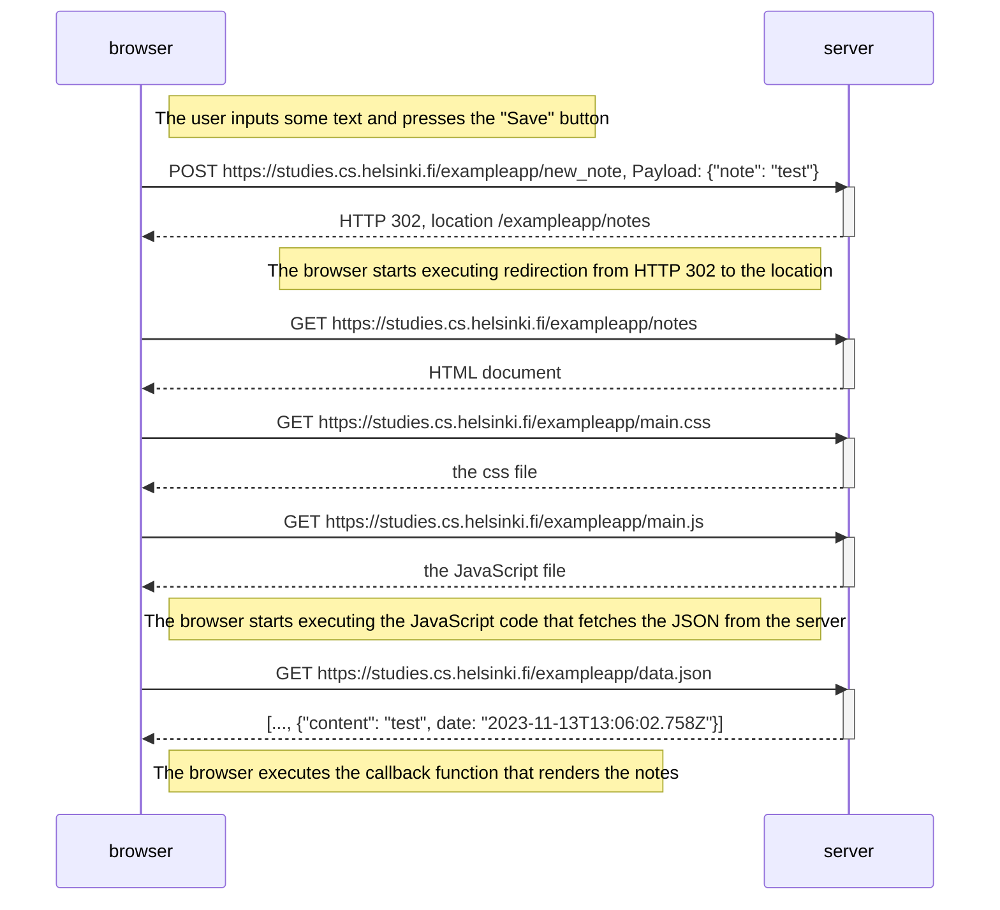

```mermaid
sequenceDiagram
    participant browser
    participant server

    Note right of browser: The user inputs some text and presses the "Save" button
    browser->>server: POST https://studies.cs.helsinki.fi/exampleapp/new_note, Payload: {"note": "test"}
    activate server
    server-->>browser: HTTP 302, location /exampleapp/notes
    deactivate server
    Note left of server: The browser starts executing redirection from HTTP 302 to the location


    browser->>server: GET https://studies.cs.helsinki.fi/exampleapp/notes
    activate server
    server-->>browser: HTML document
    deactivate server

    browser->>server: GET https://studies.cs.helsinki.fi/exampleapp/main.css
    activate server
    server-->>browser: the css file
    deactivate server

    browser->>server: GET https://studies.cs.helsinki.fi/exampleapp/main.js
    activate server
    server-->>browser: the JavaScript file
    deactivate server

    Note right of browser: The browser starts executing the JavaScript code that fetches the JSON from the server

    browser->>server: GET https://studies.cs.helsinki.fi/exampleapp/data.json
    activate server
    server-->>browser: [..., {"content": "test", date: "2023-11-13T13:06:02.758Z"}]
    deactivate server

    Note right of browser: The browser executes the callback function that renders the notes
```